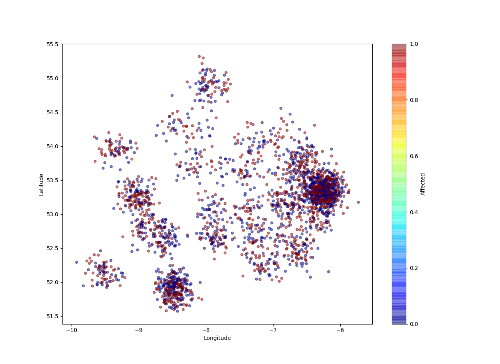

# project2

I'm making a fake heatmap of what our service would look like if like 2500 people use it

Neccesary to run:
pip3 install pandas
pip3 install matplotlib
pip3 install opencage?

server.py and client.py:
python3 client.py (open as many terminal windows as clients you desire)
python3 sever.py (1 window on the terminal)

At the moment very basic functionality:
    Clients connect to server and are asked about whether or not they want to take a COVID-19 test.
    If server exits, clients do as well.

